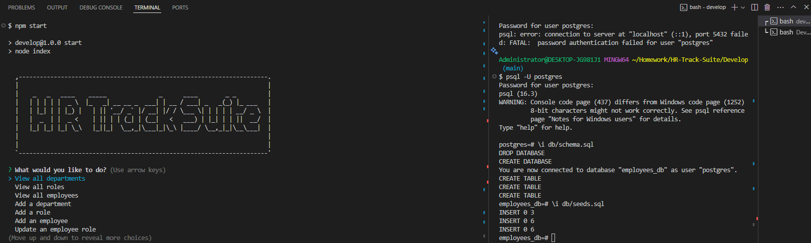
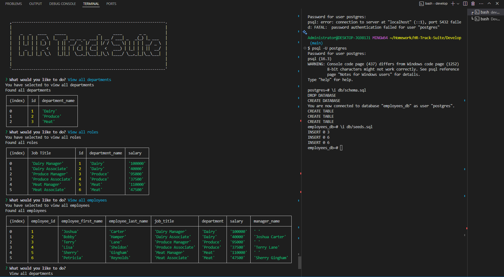
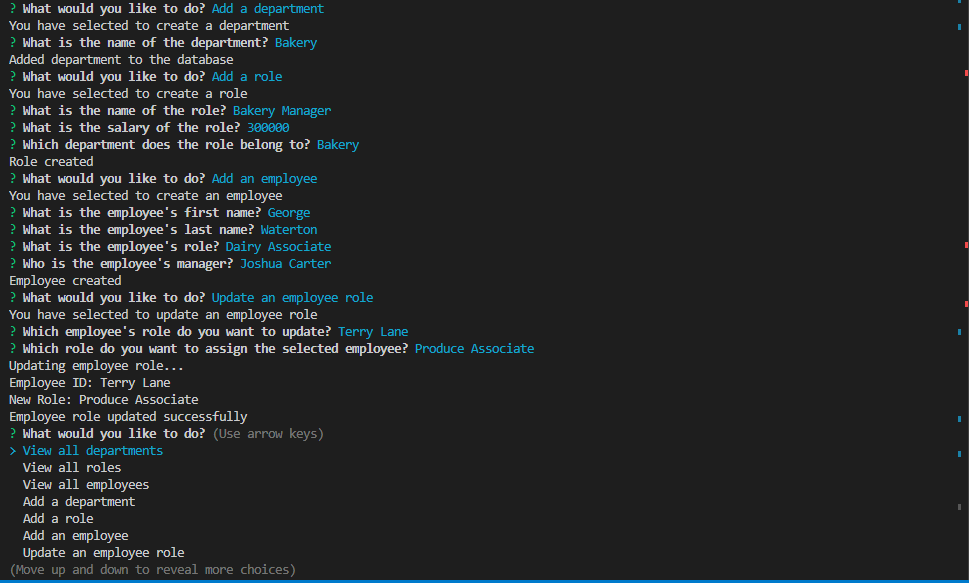

# HR-Track-Suite

- 
This application is for tracking employee data, and has a walkthrough video on how it works!

## Description

- My motivation for building this application was to create an employee data tracking application for HR called HR-Track-Suite that allows the client to track employee data on their device.
- This project was built to provide the client with an application to track employee data using their computer and or phone.
- This solves the problem of not being able to keep relevant employee data stored inside of a database for the company of the client.
- In this project, I learned that PostgreSQL is a secure and protective language that enables me to concentrate on backend development seamlessly, without affecting the vulnerability of client data.

## Table of Contents (Optional)

Here is a table of contents to make it easy for users to locate which section they need.

- [Installation](#installation)
- [Usage](#usage)
- [Credits](#credits)
- [License](#license)

## Installation

You'll need to install GitBash, VS Code, Node.js, NPM inquirer, NPM pg, Express, and PostgreSQL. From here you will need knowledge on how to clone a repo from GitHub over to your device to store it locally. Once its stored locally in your device you can open VSCode. Lastly once VSCode is running open the CLI (Command-Line-Interface), type npm install for the node_modules package, then type npm run start. Once you've done this the website will be deployed locally for testing, debugging, and developing.

## Usage

The HR Track Suite is convienient for anyone needing something to help securely store employee data. Update your employee data so that it stays up to date easily from within the CLI.

[HR Track Suite Video](https://drive.google.com/file/d/198AyyoxCXoNEa_RR2n_veZQDLGb9HLas/view?usp=drivesdk)

- <strong>HR Track Suite Screenshots:</strong>

- 
- 
- 

## Support

N/A

## Credits

People who worked on this project were bwater47. You can contact the contributors through the github profiles links listed here.
- Link: <a href="https://github.com/bwater47" alt="GitHub Link">GitHub Profile</a>

## License

- 
- This is an [https://choosealicense.com/licenses/mit/](https://choosealicense.com/licenses/mit/) license.

## Features

Secure Employee Data Tracker: Allows the client to add employee data, update, and remove record of what has been added to a table.

## Contributing

Contributing is allowed if you're in the U of U Coding Bootcamp. Contact us on the slack channel for information. 
- [Contributor Covenant](https://www.contributor-covenant.org/)

## Authors and Acknowledgment

Documentation. PostgreSQL. (05/19/24). https://www.postgresql.org/docs/ 

Routing. Express routing. (05/19/24). https://expressjs.com/en/guide/routing.html#express-router 

CLI commands. npm Docs. (05/19/24). https://docs.npmjs.com/cli/v10/commands

Node.js V22.0.0 documentation. Command-line API | Node.js v22.0.0 Documentation. (05/19/24). https://nodejs.org/api/cli.html

MozDevNet. (05/19/24). Resources for developers, by developers. MDN Web Docs. https://developer.mozilla.org/en-US/ 

Bootcamp Spot. (05/19/24). https://bootcampspot.com/

W3Schools Online Web Tutorials. (05/19/24). https://www.w3schools.com/

Chatgpt. ChatGPT. (05/19/24). https://openai.com/chatgpt

• Please note: While ChatGPT was utilized to generate dialog content for the README file, it was not involved in the generation of any code, HTML edits, CSS edits, or other assets within the repository apart from this README specifically.

• All other sources, links, and information utilized within the project were obtained from the provided sources mentioned in this paragraph. This includes class materials, modules, TA guidance, instructor-provided resources, as well as communication through platforms such as Slack or Discord. Additionally, numerous links and resources were provided within the assignment instructions and demonstrated during class sessions.

## Roadmap

Tests: N/A

## Project status

In-Progress